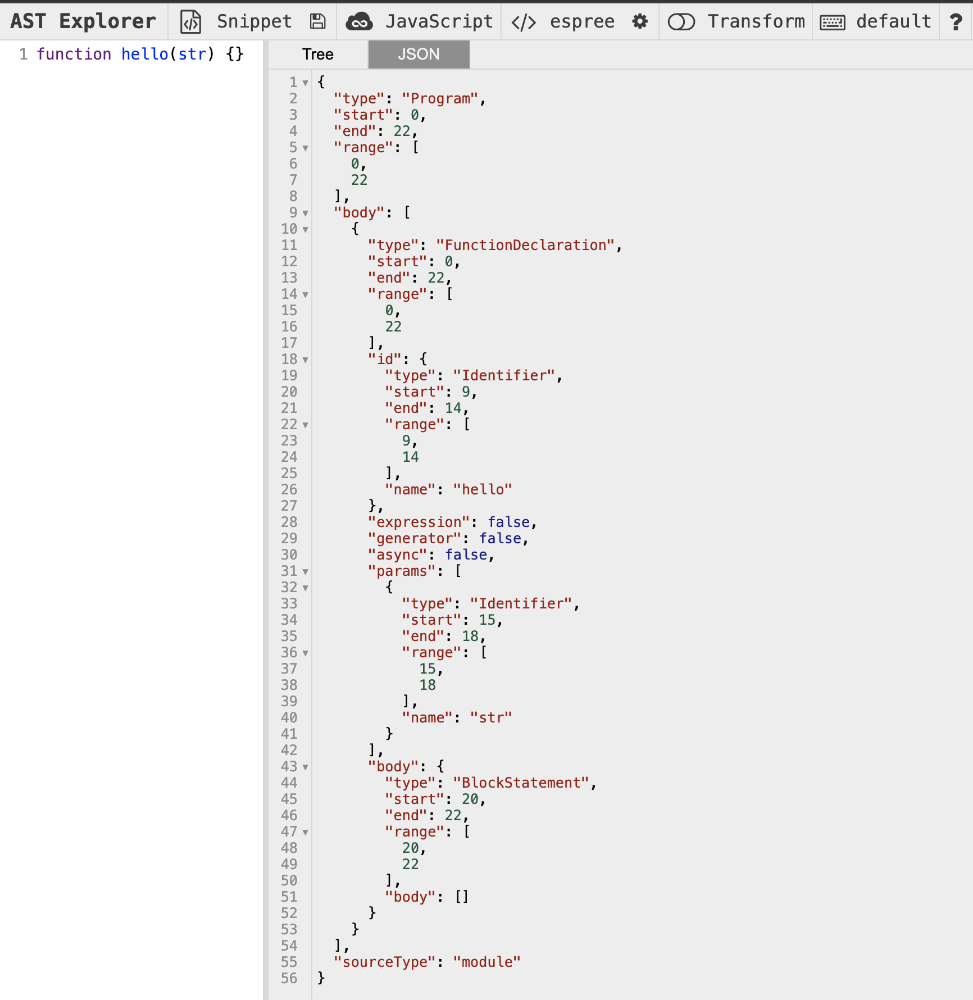

# ESLint를 활용한 정적 코드 분석

- 정적 코드 분석을 통해 버그를 사전에 방지한다.
- 정적 코드 분석이란, 코드의 실행과는 별개로 코드 그 자체만으로 코드 스멜을 찾아내어 문제가 되는 코드를 사전에 방지하는 것을 의미한다.

## 1.1 ESLint 살펴보기

### ESLint는 어떻게 코드를 분석할까?

ESLint는 JS코드를 정적 분석해 문제를 발견하고 수정까지 도와주는 도구다.

1. JS코드를 문자열로 읽는다.
2. JS코드를 분석할 수 있는 parser로 코드를 구조화한다.
3. 2번에서 구조화한 트리를 AST(Abstract Syntax Tree)라 하며, 이 구조화된 트리를 기준으로 각종 규칙과 대조한다.
4. 규칙과 대조했을 때 이를 위반한 코드를 알리거나 수정한다.

여기서 1 -> 2로 가는 과정이 중요한데, ESLint는 기본값으로 [espree](https://github.com/eslint/js/tree/main/packages/espree)를 사용한다.

espree로 파싱하면 함수 한줄로도 다양한 정보를 얻을 수 있다.

[AST explorer](https://astexplorer.net/)를 통해 파싱 결과를 확인할 수 있다.

> ESLint에서 줄바꿈, 들여쓰기 까지 다 체크할 수 있던건 위같은 파싱 결과를 통해 가능한 것이다.

ESLint가 espree로 코드를 분석한 결과로, 어떤 코드가 잘못된 건지, 어떻게 수정해야할지 정해야 한다. 이를 ESLint Rules라 하며, 특정 규칙의 모음을 plugins라고 한다.

## 1.2 eslint-plugin과 eslint-config

도서에선, ESLint v8때인 cjs 기준 설명을 제공하므로 생략한다.
단, 내가 사용하는 주요 플러그인들은,

https://bandal.dev/blog/eslint-install

- eslint: ESLint의 코어 패키지
- @eslint/eslintrc: ESLint 설정 파일을 로드하는 패키지
- eslint-plugin-import: import / export 관련 규칙
- eslint-plugin-jsx-a11y: JSX 요소의 접근성 관련 규칙
- eslint-plugin-react: JSX 및 React 컴포넌트 관련 규칙
- eslint-plugin-react-hooks: React Hooks 관련 규칙
- typescript-eslint: TypeScript 관련 ESLint 규칙을 제공하는 패키지
- @typescript-eslint/parser: TypeScript 코드를 분석하기 위한 parser
- eslint-config-prettier: ESLint와 Prettier 충돌 방지
- eslint-plugin-prettier: Prettier를 ESLint 규칙으로 실행

Next.JS 프로젝트라면 자동 설치되는

- eslint-config-next: Next.js 프로젝트에서 사용하는 ESLint 설정
- @next/eslint-plugin-next: Next.js 코드를 위한 ESLint 플러그인
