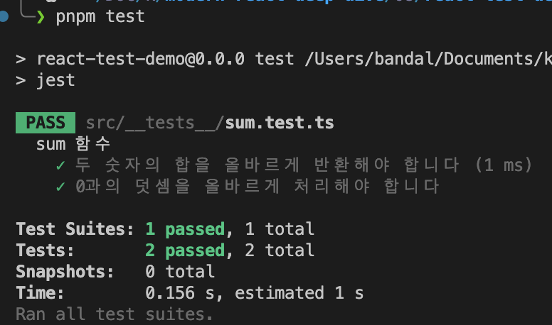

# 8.2 리액트 팀이 권장하는 리액트 테스트 라이브러리

테스트는 개발자가 작성한 코드가 의도한 대로 동작하는지 검증하는 과정입니다.

- 정상 동작 여부를 확인
- 코드 수정 후 발생할 수 있는 문제를 예방

백엔드 테스트

- 서버나 DB에서 데이터를 올바르게 불러오는지 검증
- 데이터 수정 시 교착 상태(Deadlock)나 경쟁 상태(Race condition) 발생 여부 확인
- 데이터 손실 방지 여부 점검
- 특정 상황에서 장애 발생 여부 테스트

프론트엔드 테스트

- 사용자와 유사한 환경에서 수행
- 주요 비즈니스 로직 및 예외 상황을 모두 고려
- 사용자의 행동을 최대한 예측하여 시나리오 작성
- 구현이 번거롭지만 안정적인 사용자 경험을 위해 필수

## 2.1 React Testing Library란?

React Testing Library는 DOM Testing Library를 기반으로, jsdom 위에서 React 컴포넌트를 테스트하도록 도와주는 라이브러리입니다.

- **DOM Testing Library**: jsdom 기반으로 Node.js 환경에서도 HTML과 DOM 사용 가능
- **jsdom**: 순수 자바스크립트로 구현된 가상 DOM 환경
- **React Testing Library**: Component, Provider, Hooks 등 테스트에 편리한 API 제공

## 2.2 자바스크립트 테스트의 기초

React 테스트를 살펴보기 전에, 순수 자바스크립트에서 테스트를 작성하는 기본 방식을 알아보겠습니다.

```js
// sum.js
function sum(a, b) {
  return a + b;
}
```

위 함수가 의도대로 동작하는지 확인하는 예제:

```js
// 테스트 1
let actual = sum(1, 2);
let expected = 3;

if (actual !== expected) {
  throw new Error(`${expected} !== ${actual}`);
}

// 테스트 2
actual = sum(2, 2);
expected = 4;

if (actual !== expected) {
  throw new Error(`${expected} !== ${actual}`);
}
```

### 테스트 작성 절차

1. 테스트 대상 함수 또는 모듈 선정
2. 기대하는 반환 값 정의
3. 실제 반환 값 호출
4. 기대 값과 실제 값 비교
5. 불일치 시 에러 발생

위 과정을 자동화하려면 Node.js의 `assert` 모듈을 사용할 수 있습니다.

```js
// sum.test.js
const assert = require("assert");

assert.equal(sum(1, 2), 3);
assert.equal(sum(2, 2), 4);
assert.equal(sum(2, 2), 5); // AssertionError: 5 === 4
```

이처럼 테스트 결과를 검증해주는 라이브러리를 **어설션(assertion) 라이브러리**라고 합니다.  
대표 예시: `assert`, `should.js`, `expect.js`, `chai` 등

테스트 코드는 사람이 읽기 쉽고 목적이 명확해야 합니다.  
위 예시는 기능 검증에는 성공했지만, 어떤 동작을 확인하는지 모호하며 CI 환경에서 결과를 파악하기 어렵습니다.  
이러한 문제를 해결해주는 도구가 **테스팅 프레임워크**입니다.

### 주요 자바스크립트 테스팅 프레임워크

- Jest
- Mocha
- Jasmine
- Tape

리액트 환경에서는 **Jest**가 널리 사용되며, 최근에는 **Vitest**도 주목받고 있습니다.

위 테스트 코드를 Jest로 작성하면 아래와 같습니다.

```js
import { sum } from "../utils/sum";

describe("sum 함수", () => {
  it("두 숫자의 합을 올바르게 반환해야 합니다", () => {
    expect(sum(1, 2)).toBe(3);
    expect(sum(5, 7)).toBe(12);
    expect(sum(-1, 1)).toBe(0);
  });

  it("0과의 덧셈을 올바르게 처리해야 합니다", () => {
    expect(sum(0, 5)).toBe(5);
    expect(sum(5, 0)).toBe(5);
    expect(sum(0, 0)).toBe(0);
  });
});
```

```bash
pnpm test
```

위 코드를 실행하면 아래와 같은 결과가 나옵니다.



테스팅 프레임워크를 이용하면 테스트 결과를 좀 더 명확하게 확인할 수 있습니다.

특이한 점으론 `describe`와 `it`을 import 없이 사용했다는 것입니다.  
이는 Jest CLI(pnpm test)의 기능으로, 테스트에 필요한 자원들을 실행 시 전역 스코프에 넣어주기 때문입니다.

## 2.3 리액트 컴포넌트 테스트 코드 작성하기

리액트에서 컴포넌트 테스트는 아래 순서로 진행된다.

1. 컴포넌트를 렌더링한다.
2. 필요하다면 컴포넌트에서 특정 액션을 수행한다.
3. 컴포넌트 렌더링과 2번의 액션을 통해 기대하는 결과와 실제 결과를 비교한다.

### 프로젝트 생성

책에선 CRA를 안내하는데, 없어지고 vite를 차기 CRA로 안내하고 있다. 고로 vite로 만들었다.  
vite는 기본적으로 test 구성도 안해줘서 직접 했다..

[App.test.tsx](./react-test-demo/src/App.test.tsx)를 살펴보면,

1. `<App />`을 렌더링 한다.
2. `screen`에서 특정 조건을 만족하는 DOM 요소를 찾는다.
3. `expect(...).toBeInTheDocument()`를 통해 요소가 존재하는지 확인한다.

위와 같이 테스트 코드를 작성하면, 테스트 코드를 실행하면 테스트가 성공하거나 실패한다.
이중 2번의 특정 조건을 만족하는 DOM을 찾으려면, 아래 코드를 사용한다.

### 테스트 구조화 함수

#### describe

- 연관된 테스트들을 하나의 그룹으로 묶음
- 테스트 코드의 가독성과 구조화를 위해 사용
- 중첩 사용 가능

```js
describe("컴포넌트 이름", () => {
  describe("특정 기능", () => {
    // 테스트 케이스들
  });
});
```

#### it/test

- 개별 테스트 케이스를 정의
- it은 test의 alias로 동일한 기능
- 테스트의 목적을 명확하게 설명하는 문자열과 함께 사용

```js
it("특정 동작을 수행해야 합니다", () => {
  // 테스트 로직
});
```

#### beforeEach

- 각 테스트 케이스 실행 전에 수행될 작업 정의
- 테스트 환경 초기화나 공통 설정에 사용

```js
beforeEach(() => {
  // 초기화 로직
});
```

### 렌더링 & DOM 조작

#### render

- 컴포넌트를 테스트 환경에 렌더링
- jsdom 환경에서 가상 DOM 생성

```js
render(<Component props={value} />);
```

#### screen

- 렌더링된 DOM에서 요소를 찾기 위한 객체
- 다양한 쿼리 메서드 제공

#### fireEvent

- 사용자 이벤트를 시뮬레이션하는 유틸리티
- 클릭, 입력, 포커스 등 다양한 이벤트 지원

```js
fireEvent.click(button);
fireEvent.change(input, { target: { value: "test" } });
```

### 요소 선택자 (Queries)

#### 동기 선택자

- `getBy...`: 단일 요소 선택 (없으면 에러)
- `getAllBy...`: 복수 요소 선택 (없으면 에러)
- `queryBy...`: 단일 요소 선택 (없으면 null)
- `queryAllBy...`: 복수 요소 선택 (없으면 빈 배열)

#### 비동기 선택자

- `findBy...`: 비동기 단일 요소 선택 (Promise 반환)
- `findAllBy...`: 비동기 복수 요소 선택 (Promise 반환)

#### 선택자 변형

- `ByRole`: ARIA role로 선택
- `ByLabelText`: label 텍스트로 선택
- `ByPlaceholderText`: placeholder로 선택
- `ByText`: 텍스트 내용으로 선택
- `ByDisplayValue`: form 필드의 현재 값으로 선택
- `ByAltText`: alt 속성으로 선택
- `ByTitle`: title 속성으로 선택
- `ByTestId`: data-testid 속성으로 선택
  - testId 기반 조회는 안티패턴이다, 아니다 로 많이 갈리는 주제이다.
  - Test 원칙인 `"실제 사용자와 동일한 환경"`과 어긋난다. 사용자는 data-testId로 접근할 일이 없기 때문

### 검증 함수 (Matchers)

#### DOM 관련

- `toBeInTheDocument()`: 요소가 문서에 존재하는지 확인
- `toHaveTextContent(text)`: 요소의 텍스트 내용 검증

```js
expect(element).toBeInTheDocument();
expect(element).toHaveTextContent("예상 텍스트");
```

#### 이벤트 & 함수 호출 관련

- `toHaveBeenCalled()`: 함수가 호출되었는지 확인
- `toHaveBeenCalledWith(...args)`: 특정 인자로 호출되었는지 확인
- `toHaveBeenCalledTimes(number)`: 호출 횟수 확인

```js
expect(mockFn).toHaveBeenCalledWith(1);
expect(mockFn).toHaveBeenCalledTimes(2);
```

### 모의(Mock) 함수

#### jest.fn()

- 함수의 호출을 추적할 수 있는 모의 함수 생성
- 호출 여부, 호출 인자, 호출 횟수 등 추적 가능

```js
const mockCallback = jest.fn();
expect(mockCallback).toHaveBeenCalled();
```

### [@DynamicCounter.test.tsx](./react-test-demo/src/components/DynamicCounter.test.tsx) 특화 사용 예시

```js
// 컴포넌트 렌더링
render(<DynamicCounter initialCount={10} />);

// 요소 선택
const countValue = screen.getByTestId("count-value");
const incrementButton = screen.getByTestId("increment-button");

// 이벤트 발생
fireEvent.click(incrementButton);

// 콜백 함수 모의
const handleCountChange = jest.fn();
render(<DynamicCounter onCountChange={handleCountChange} />);

// 상태 변화 검증
expect(countValue).toHaveTextContent("12");
expect(handleCountChange).toHaveBeenCalledWith(1);
```

### 실행 추적 함수

spyOn

비동기 컴포넌트 테스트에 유리

## 2.4 사용자 정의 훅 테스트하기

## 2.5 테스트를 작성하기에 앞서 고려해야 할 점

## 그 밖에 해볼 만한 여러 가지 테스트
